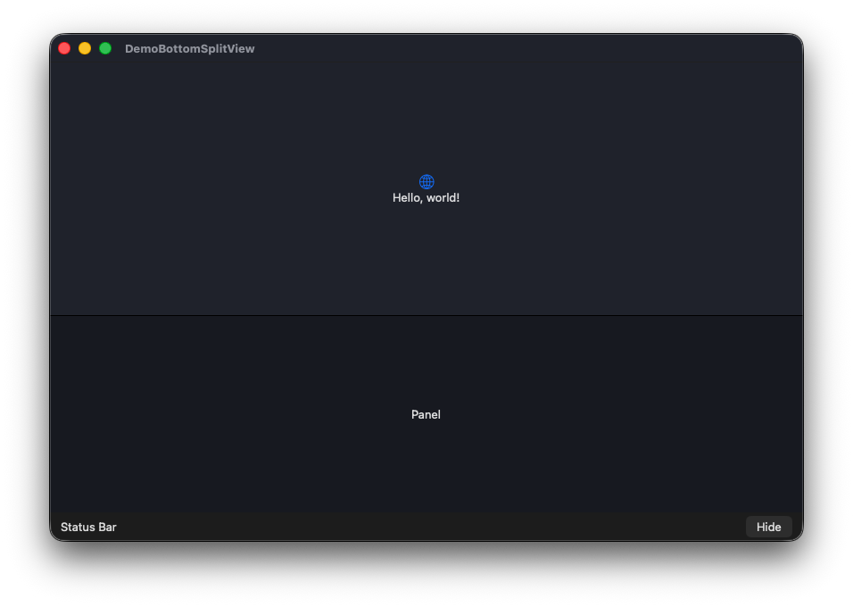

# BottomSplitView

A SwiftUI-friendly bottom split view for macOS apps. `BottomSplitView` gives you a primary content area, a resizable bottom panel, and a status bar that remains visible when the panel is collapsed.

The package is useful for editor-style interfaces, consoles, inspectors, logs, timelines, and any macOS UI where a secondary panel should slide between collapsed and expanded states without losing the bottom status controls.

## Preview

<!-- Example:  -->


## Requirements

- macOS 14 or later
- Swift 6
- SwiftUI

## Installation

Add this package to your app with Swift Package Manager.

In Xcode:

1. Open your app project.
2. Select **File > Add Package Dependencies...**.
3. Enter the repository URL for this package.
4. Add the `BottomSplitView` product to your macOS app target.

Or add it to another Swift package:

```swift
dependencies: [
    .package(url: "https://github.com/chatoutsidis/BottomSplitView.git", from: "0.1.0")
]
```

Then add `BottomSplitView` to the target that uses it:

```swift
.target(
    name: "YourApp",
    dependencies: ["BottomSplitView"]
)
```

## Basic Usage

Import the package and bind the panel presentation state from your SwiftUI view.

```swift
import SwiftUI
import BottomSplitView

struct ContentView: View {
    @State private var isPanelPresented = true

    var body: some View {
        BottomSplitView(
            isPanelPresented: $isPanelPresented,
            defaultPanelHeight: 220,
            minPanelHeight: 140,
            maxPanelHeight: .greatestFiniteMagnitude
        ) {
            mainContent
        } panel: {
            bottomPanel
        } statusBar: {
            statusBar
        }
        .frame(minWidth: 700, minHeight: 450)
    }

    private var mainContent: some View {
        Text("Primary content")
            .frame(maxWidth: .infinity, maxHeight: .infinity)
    }

    private var bottomPanel: some View {
        Text("Bottom panel")
            .frame(maxWidth: .infinity, maxHeight: .infinity)
            .background(Color.black.opacity(0.08))
    }

    private var statusBar: some View {
        HStack {
            Text("Status")
            Spacer()
            Button(isPanelPresented ? "Hide" : "Show") {
                isPanelPresented.toggle()
            }
        }
        .padding(.horizontal, 12)
        .frame(maxWidth: .infinity, maxHeight: .infinity)
        .background(Color(NSColor.windowBackgroundColor))
    }
}
```

## How It Works

`BottomSplitView` renders three SwiftUI areas:

- `primary`: the main content above the divider.
- `panel`: the expandable content in the bottom split area.
- `statusBar`: the always-visible bottom strip.

When `isPanelPresented` is `true`, the bottom area contains the panel plus the status bar. When it is `false`, the panel collapses and only the status bar remains visible.

Users can drag the divider to resize the panel. If they drag the panel below the collapse snap threshold and release, the panel collapses and the binding is updated to `false`. Expanding again restores the most recent expanded panel height, clamped to the configured limits.

## Configuration

```swift
BottomSplitView(
    isPanelPresented: $isPanelPresented,
    defaultPanelHeight: 220,
    minPanelHeight: 140,
    maxPanelHeight: 500,
    statusBarHeight: 32,
    collapseSnapThreshold: 90,
    dividerHitExtension: 10
) {
    // Primary content
} panel: {
    // Bottom panel
} statusBar: {
    // Status bar
}
```

| Parameter | Description |
| --- | --- |
| `isPanelPresented` | A binding that controls whether the bottom panel is expanded. The component also updates this binding when the user collapses or expands by dragging. |
| `defaultPanelHeight` | The initial expanded panel height, excluding the status bar. |
| `minPanelHeight` | The minimum expanded panel height. |
| `maxPanelHeight` | The maximum expanded panel height. Use `.greatestFiniteMagnitude` to let available window height decide the limit. |
| `statusBarHeight` | The fixed height of the status bar. Defaults to `32`. |
| `collapseSnapThreshold` | If the panel is dragged below this height and released, it collapses. Defaults to `90`. |
| `dividerHitExtension` | Extra interactive height added around the divider to make resizing easier. Defaults to `10`. |

## Demo App

A small example app is included in `Examples/DemoApp`. Open the demo project in Xcode to see `BottomSplitView` wired into a SwiftUI macOS app.

## Development

Run the package tests from the repository root:

```sh
swift test
```
